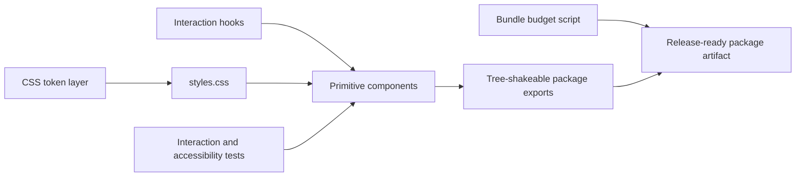

# Helix UI

Accessible React component primitives built from scratch.

Helix UI is a package-quality component library focused on the hard parts of frontend UI engineering: keyboard interaction, focus management, ARIA state, tokenized styling, bundle budgets, and testable compound-component APIs.

It deliberately avoids Radix, Headless UI, and other headless frameworks so the implementation proves the underlying mechanics rather than wrapping somebody else's primitives.

**Release status:** v0.1.0 is tagged, release-ready, and validated by CI. The npm package has not been published yet, so the current install path is local package verification:

```bash
npm install
npm run build
npm run pack:check
```

Example consumer API once installed from the workspace or future package:

```tsx
import '@codejupiter/helix-ui/styles.css';
import { Button, Dialog, ToastProvider } from '@codejupiter/helix-ui';

function Example() {
  return (
    <ToastProvider>
      <Dialog>
        <Dialog.Trigger><Button>Confirm</Button></Dialog.Trigger>
        <Dialog.Content>
          <Dialog.Title>Are you sure?</Dialog.Title>
          <Dialog.Description>This cannot be undone.</Dialog.Description>
          <Dialog.Close><Button variant="ghost">Cancel</Button></Dialog.Close>
          <Button variant="danger">Delete</Button>
        </Dialog.Content>
      </Dialog>
    </ToastProvider>
  );
}
```

## Status

**All 16 planned primitives shipped.** 112 tests passing. Zero runtime dependencies.

| Signal | Evidence |
| ------ | -------- |
| Primitive coverage | 16 shipped primitives across inputs, overlays, navigation, feedback, and display |
| Accessibility ownership | Custom focus trap, roving tabindex, ARIA listbox/combobox patterns, visible focus rings |
| Test coverage | 112 Vitest + Testing Library interaction tests |
| Bundle discipline | 8.4 KB gzip ESM bundle, 4.1 KB gzip CSS |
| Release discipline | CI runs audit, lint, typecheck, tests, build, size budgets, and package dry run |

## Documentation

- [API reference](docs/API.md) — install, exports, compound components, theming, package shape, and bundle budgets.
- [Accessibility contract](docs/ACCESSIBILITY.md) — primitive behavior, consumer responsibilities, testing strategy, and release checklist.
- [Release checklist](docs/RELEASE_CHECKLIST.md) — validation gates, package contents, npm publishing, and next release candidates.
- [Helix UI v0.1.0 release notes](docs/releases/helix-ui-v0.1.0.md) — release summary, engineering highlights, evidence, and known limits.
- [Changelog](CHANGELOG.md) — package release history.

| Primitive    | Notes                                                         |
| ------------ | ------------------------------------------------------------- |
| Button       | 4 variants, 3 sizes, loading state, icon slots                |
| Input        | Invalid state via `aria-invalid`                              |
| Checkbox     | Visually-hidden native input + styled overlay                 |
| Switch       | `role="switch"` for assistive tech                            |
| RadioGroup   | Context-driven group + items, mutual exclusivity              |
| Slider       | Keyboard (arrows, Home/End, PageUp/Down) + pointer drag       |
| Select       | Custom combobox + listbox with full keyboard navigation       |
| Avatar       | Image with deterministic initials fallback                    |
| Progress     | Determinate + indeterminate states                            |
| Tooltip      | Hover/focus triggered with delay                              |
| Popover      | Click-triggered with outside-click and Escape dismissal       |
| Dialog       | Focus trap, scroll lock, return focus, full ARIA              |
| Toast        | Stacking notifications with auto-dismiss                      |
| Tabs         | ARIA tabs pattern with roving tabindex                        |
| Accordion    | Single + multi-expand modes                                   |
| DropdownMenu | Keyboard-navigable menu with arrow keys                       |

## Design principles

- **Custom-built, no headless dependencies.** Every interactive primitive is implemented from scratch — no Radix, no Headless UI. Accessibility isn't outsourced; it's owned.
- **Native semantics first.** Where the browser has the right element (`<button>`, `<input type="checkbox">`), we use it. The styled-overlay pattern keeps screen readers, keyboard users, and form submission happy.
- **Tokens over hardcoded values.** All visual properties reference CSS custom properties under the `--helix-*` namespace. Theming is a single-file change.
- **Tree-shakeable.** Each component is a separate file with no side effects beyond CSS. Import what you use.
- **Tested.** 112 tests across 16 components — unit + interaction via Vitest + Testing Library.

## Bundle size

Real measurements from the latest build:

| Output      | Raw     | Gzipped |
| ----------- | ------- | ------- |
| ESM bundle  | 38 KB   | 8.4 KB  |
| CSS         | 26 KB   | 4.1 KB  |

Zero runtime dependencies. React 18+ peer dependency only.

## Theming

Two themes ship by default:

```tsx
<div data-helix-theme="dark">  {/* default */}
  <Button>Dark</Button>
</div>

<div data-helix-theme="light">
  <Button>Light</Button>
</div>
```

Override any token by setting CSS custom properties:

```css
:root {
  --helix-accent: #f97316;
  --helix-radius-md: 0.125rem;
}
```

## Accessibility

Every primitive is built against WCAG 2.1 AA standards.

- All interactive elements are keyboard-accessible
- Focus states use visible 3px outline rings (not just color)
- Labels are properly associated via `htmlFor` / `id`
- ARIA attributes are applied where native semantics aren't sufficient
- `prefers-reduced-motion` is honored (transitions become instant)
- Dialog implements full focus trap + scroll lock + return focus
- Composite controls implement keyboard navigation patterns from the WAI-ARIA Authoring Practices

## Architecture highlights

A few engineering details worth noting:



- **Compound components for complex primitives.** Dialog, Tabs, Accordion, Select, and DropdownMenu use `Object.assign` exports (e.g. `Tabs.List`, `Tabs.Trigger`, `Tabs.Content`) to keep their APIs cohesive while remaining tree-shakeable.
- **Context-driven shared state.** RadioGroup, Tabs, Accordion, Select, and Dialog use React Context to share state between root and children without prop drilling. Each context throws a helpful error if used outside its parent.
- **Custom focus trap implementation.** `useFocusTrap` walks the focusable-element selector list, manages Tab / Shift+Tab cycling, and restores focus on cleanup. Used by Dialog.
- **Roving tabindex for composite controls.** Tabs uses the proper ARIA roving tabindex pattern: only the active tab is in the tab order; arrow keys move focus and activate.
- **`aria-activedescendant` for Select.** Select uses the listbox-with-active-descendant pattern so keyboard navigation doesn't move DOM focus while still announcing the highlighted option to screen readers.

## Development

```bash
# Install
npm install

# Run tests in watch mode
npm run test:watch

# Build the library
npm run build

# Typecheck
npm run typecheck

# Verify bundle budgets and package contents
npm run size
npm run pack:check
```

## Quality gates

GitHub Actions runs production audit, lint, typecheck, the full Vitest component suite, package build, bundle-size budgets, and `npm pack --dry-run`. This keeps the library honest as a publishable package, not just a local component demo.

Before publishing or creating a GitHub release, run the [release checklist](docs/RELEASE_CHECKLIST.md).

## License

MIT — Zoriah Cocio
